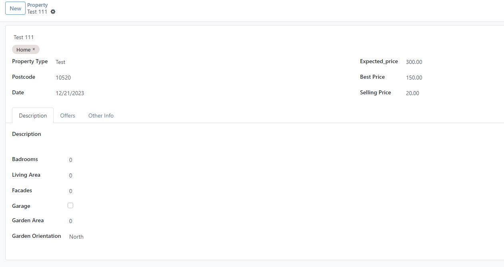
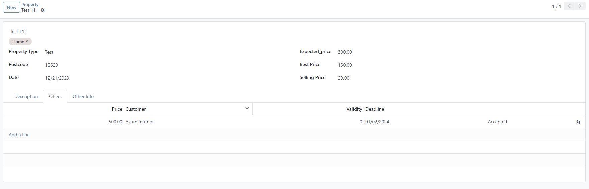
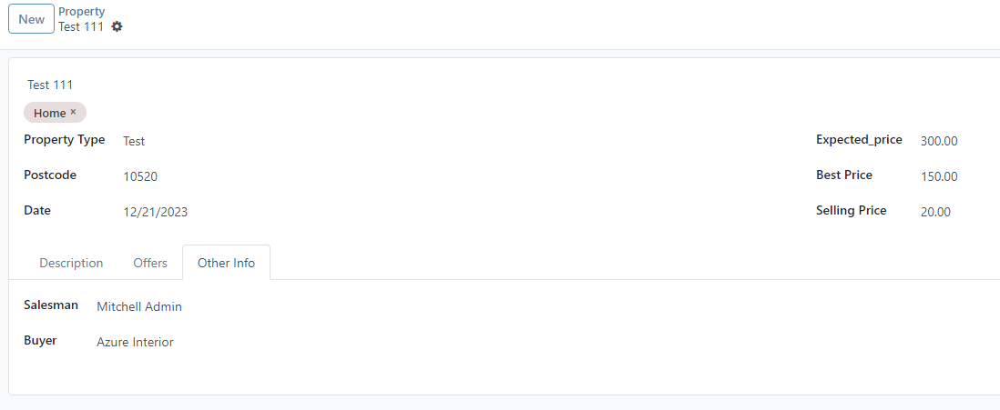

property_view.xml add in recrod id : estate_property_form_view

```xml
<notebook>
    <page string="Description">
        <group>
            <field name="description"/>
            <field name="badrooms"/>
            <field name="living_area"/>
            <field name="facades"/>
            <field name="garage"/>
            <field name="garden_area"/>
            <field name="garden_orientation"/>
        </group>
    </page>
    <page string="Offers">
        <field name="offer_ids">
            <tree editable="bottom">
                <field name="price"/>
                <field name="partner_id"/>
                <field name="validity"/>
                <field name="deadline"/>
                <field name="status" nolabel="1"/>
            </tree>
        </field>
    </page>
    <page string="Other Info">
        <group>
            <field name="sales_id"/>
            <field name="buyer_id"/>
        </group>
    </page>
</notebook>
```

file property.py add field in class property**

```python
sales_id = fields.Many2one('res.users', string="Salesman")
buyer_id = fields.Many2one('res.partner', string="Buyer")
```

file property_offer.py add field in class PropertyOffer**

```python
validity = fields.Integer(string="Validity")
deadline = fields.Date(string="Deadline")
```

## ผลลัพธ์


