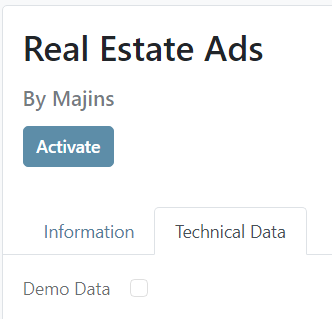

:::note
💡 ถ้า Demo Data ไม่เท่ากับ True ระบบจะไม่ทำการสร้าง Demo data ให้



:::

file data in folder data : property_type.xml

```xml
<odoo>
    <data noupdate="1">
        <record id="property_type_house" model="estate.property.type">
            <field name="name">House</field>
        </record>
        <record id="property_type_apertment" model="estate.property.type">
            <field name="name">Apertment</field>
        </record>
        <record id="property_type_penthouse" model="estate.property.type">
            <field name="name">Penthouse</field>
        </record>
        <record id="property_type_castle" model="estate.property.type">
            <field name="name">Castle</field>
        </record>
    </data>
</odoo>
```

file __manifest__.py

```xml
{
    .....
    "data": [
        ....
        ### Data Files
        'data/property_type.xml' ## Case xml
        'data.estate.porperty.type.csv' ## Case csv
        ....
    ],
    "demo": [
        'demo/property_tag.xml'
    ],
    .....
}
```

file csv in folder data : estate.property.type.csv

```
"id","name"
property_type_house,"House"
property_type_apertment,"Apertment"
property_type_penthouse,"Penthouse"
property_type_castle,"Castle"
```

file demo in folder demo : property_tag.xml

```xml
<odoo>
    <data>
        <record id="property_tag_cozy" model="estate.property.tag">
            <field name="name">Cozy</field>
        </record>
        <record id="property_tag_renovated" model="estate.property.tag">
            <field name="name">Renovated</field>
        </record>
        <record id="property_tag_new" model="estate.property.tag">
            <field name="name">New</field>
        </record>
        <record id="property_tag_abandoned" model="estate.property.tag">
            <field name="name">Abandoned</field>
        </record>
    </data>
</odoo>
```