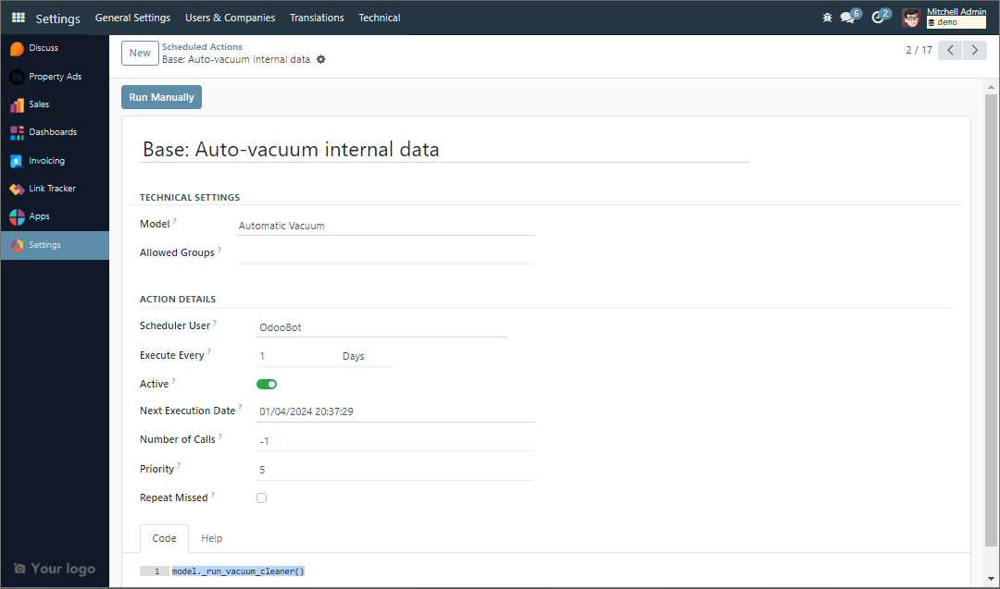

# Method Decorators

## @api.autovacuum

ใน Odoo `@api.autovacuum` เป็นตัวตกแต่งที่ใช้ในโค้ด Python เพื่อทำเครื่องหมายวิธีการดูดฝุ่นอัตโนมัติ เครื่องมือตกแต่งนี้มักใช้ในรุ่น Odoo เพื่อกำหนดเวลาการทำความสะอาดบันทึกอัตโนมัติ

การดูดฝุ่นในฐานข้อมูลเป็นกระบวนการที่เรียกคืนพื้นที่และทำให้ฐานข้อมูลมีประสิทธิภาพมากขึ้นโดยการลบข้อมูลที่ล้าสมัย ในบริบทของ Odoo `@api.autovacuum` ช่วยจัดการและเพิ่มประสิทธิภาพฐานข้อมูลโดยการล้างบันทึกที่ไม่ได้ใช้หรือไม่จำเป็นเป็นประจำ

เมื่อนำไปใช้กับวิธีการในรุ่น Odoo เจ้าหน้าที่ `@api.autovacuum` ตกแต่งจะกำหนดเวลาให้ดำเนินการวิธีการนั้นในระหว่างกระบวนการดูดฝุ่นอัตโนมัติ สิ่งนี้มีประโยชน์อย่างยิ่งสำหรับโมเดลที่มีบันทึกจำนวนมาก หรือเมื่อจำเป็นต้องล้างข้อมูลเป็นประจำเพื่อปรับปรุงประสิทธิภาพของฐานข้อมูล

```python
@api.autovacuum
def _clear_offers(self):
    self.search(['status','=', 'refused']).unlink
```



## @api.model >>>> [readmore](https://www.odoo.com/documentation/17.0/developer/reference/backend/orm.html?highlight=api%20model#odoo.api.model)

```python
from odoo import fields, api

@api.model
def _set_create_date(self):
    return fields.Date.today()

creation_date = fields.Date(string="Create Date", default=_set_create_date)
```

## @api.model_create_multi >>>> [readmore](https://www.odoo.com/documentation/17.0/developer/reference/backend/orm.html?highlight=api%20model#odoo.api.model_create_multi)

```python
@api.model_create_multi
def create(self, vals):
    for rec in vals:
        if not rec.get('creation_date'):
            res['creation_date'] = fields.Data.today()
    return super(PropertyOffer, self).create(vals)
```

## @**api.onchange >>>> [readmore](https://docs.majin.xyz/docs/next/Indepth%20nderstanding%20of%20models%20and%20logics/lecture20)**

## @**api.depends >>>> [readmore](https://docs.majin.xyz/docs/next/Indepth%20nderstanding%20of%20models%20and%20logics/lecture20)**

## @api.depends_context

:::note
💡 self.env.context
self._context
:::

Ex. ตัวอย่างในการทำงาน

```python
price = fields.Float(compute='_compute_product_price')

@api.depends_context('pricelist')
def _compute_product_price(self):
    for product in self:
        if product.env.context.get('pricelist'):
            pricelist = self.env['product.pricelist'].browse(product.env.context['pricelist'])
        else:
            pricelist = self.env['product.pricelist'].get_default_pricelist()
        product.price = pricelist._get_products_price(product).get(product.id, 0.0)
```

## @api.constrains

:::note
💡 รองรับเฉพาะชื่อฟิลด์ธรรมดา ส่วนชื่อจุด (ฟิลด์ของฟิลด์เชิงสัมพันธ์ เช่น Partner_id.customer) จะไม่ได้รับการสนับสนุนและจะถูกละเว้น
:::
ตัวตรวจสอบข้อจำกัด : แต่ละอาร์กิวเมนต์จะต้องเป็นชื่อฟิลด์ที่ใช้ในการตรวจสอบ

```python
from odoo.exceptions import ValidationError

@api.constrains('validity')
def _check_validity(self):
    for rec in self:
        if rec.deadline < rec.creation_date:
            raise ValidationError(_("Deadline cannot be before creation date"))
```

เรียกใช้ในเรกคอร์ดที่มีการแก้ไขฟิลด์ที่ระบุชื่อรายการใดรายการหนึ่ง ควรเพิ่ม [ValidationError](https://www.odoo.com/documentation/17.0/developer/reference/backend/orm.html?highlight=api%20model#odoo.exceptions.ValidationError) หากการตรวจสอบล้มเหลว

## @**api.ondelete ********

:::note
💡 เมธอดที่ตกแต่งด้วย @ondelete ควรทำให้เกิดข้อผิดพลาดตามเงื่อนไขบางประการ และตามแบบแผน ควรตั้งชื่อเมธอดว่า
:::

Ex. ตัวอย่าง

```python
@api.ondelete(at_uninstall=False)
def _unlink_if_user_inactive(self):
    if any(user.active for user in self):
        raise UserError("Can't delete an active user!")

# same as above but with _unlink_except_* as method name
@api.ondelete(at_uninstall=False)
def _unlink_except_active_user(self):
    if any(user.active for user in self):
        raise UserError("Can't delete an active user!")
```

## Sql constraints

:::note
💡 หลังจากเพิ่ม sql constraints ต้องทำการ install app ใหม่
:::

```python
_sql_constraints = [
    ('check_validity', 'check(validity > 0)', 'Deadline cannot be before creation date')
]
```